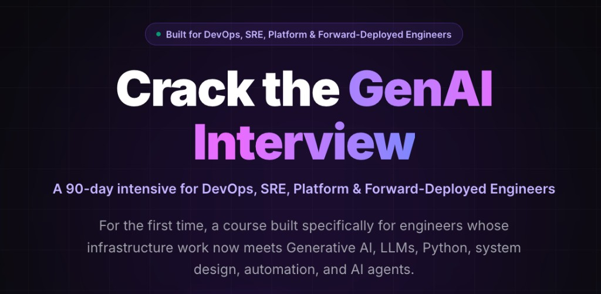

# Crack the GenAI Interview

**A 90-day intensive for DevOps, SRE, Platform & Forward-Deployed Engineers.**

Built for engineers whose infrastructure work now meets Generative AI, LLMs, Python, system design, automation, and AI agents. This is a hands-on program for people who already run production systems and need to interview, design, and operate where that work and GenAI overlap.

The live curriculum starts from how models actually behave (tokens, memory, and what “GPT” means), then moves through Python, Linux internals, system design, and GPUs. This repository holds the exercises and lab material that go with those sessions.

## Links

- 📌 Website: https://www.ideaweaver.ai
- 📌 Morning Batch: https://www.ideaweaver.ai/purchase?product_id=6827463
- 📌 Evening Batch: https://www.ideaweaver.ai/purchase?product_id=6827464
- 📌 Self-Paced Batch: https://www.ideaweaver.ai/purchase?product_id=6827466
- 📌 Complete Program Details: https://www.ideaweaver.ai/courses/cracking-the-genai-interview-for-devops-sre-platform-forward-deployed-engineers-morning1/lectures/66591133

## Who it’s for

DevOps, SRE, platform, and forward-deployed engineers who want a course aimed at their job, not a generic software-engineering GenAI track.

## What’s in this repo

| Path | What it covers |
| --- | --- |
| [`data_structures/basic`](data_structures/basic) | Python fundamentals: types, collections, complexity, comprehensions, functions, and classes. |
| [`data_structures/dsa_patterns_python-master/1_two_pointers`](data_structures/dsa_patterns_python-master/1_two_pointers) | Two-pointer interview problems, with local solutions mapped to LeetCode. |
| [`linux_performance_debugging`](linux_performance_debugging) | Scripts that inspect CPU, memory, disk I/O, and network for a running process. |
| [`kubernetes-genai`](kubernetes-genai) | k3s setup scripts and sample GPU pod manifests. |
| [`vllm-eks`](vllm-eks) | Scripts that create an EKS cluster (GPU nodes with a CPU fallback), deploy vLLM, serve a Qwen3 model, and test it. |
| [`token_count_cost`](token_count_cost) | A script that calls a model API and estimates input and output token cost. |

## License

Apache License 2.0. See [LICENSE](LICENSE).
